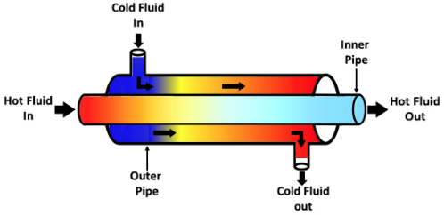
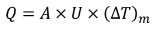
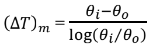
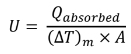
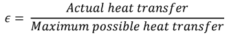
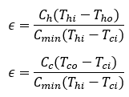

## INTRODUCTION 

#### User Objectives and Goals:
 
1. To determine the Log mean temperature difference.
 
2. To determine the  overall heat transfer coefficient for the inside area.
 
3. To determine the effectiveness of the heat exchanger.

 
#### Theory

A heat exchanger is a system used to transfer heat between two fluids, one hot and one cold as shown in Fig. 1.

 
Fig 1. Schematic representation of a heat exchanger

Heat transfer from one fluid to another fluid is given by the expression, 

Where, 
	(∆T)m is the mean temperature difference
	U is the overall heat transfer coefficient for the inside area 
	A is the inside area of the heat exchanger 

Temperature Profiles for Parallel and Counter Flow Heat Exchangers

For which,

This expression for the mean temperature difference is known as the Log Mean Temperature Difference (LMTD).

In order to make comparisons between various types of heat exchangers, the term Heat Exchanger Effectiveness is used, which is defined as:

Actual heat transfer may be computed by calculating the energy lost by the hot fluid or the energy gained by the cold fluid as Q = Ch (Thi-Tho ) or Q= Cc (Tco-Tci ).

Both for parallel and counter flow heat exchanger where 
 Ch= Wh Cph and Cc= Wc Cpc

Wh = mass of hot fluid flowing per unit time 
Wc = mass of cold fluid flowing per unit time 
Cph and Cpc are the specific heats of the hot and cold fluid respectively 
Maximum possible heat transfer is given by  
Qmax= Cmin (Thi-Tci )

Where Cmin is either Cph or Cpc, whichever is lesser.
Hence, effectiveness

#### Equations/formulas:

Log Mean Temperature Difference (LMTD).

 
 

Effectiveness (ϵ)

